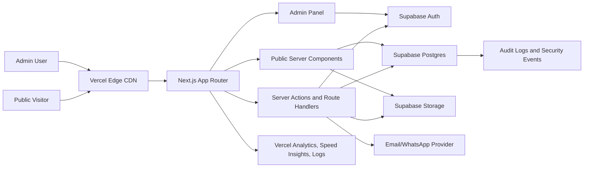
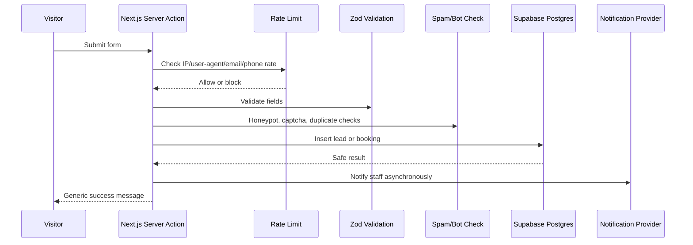
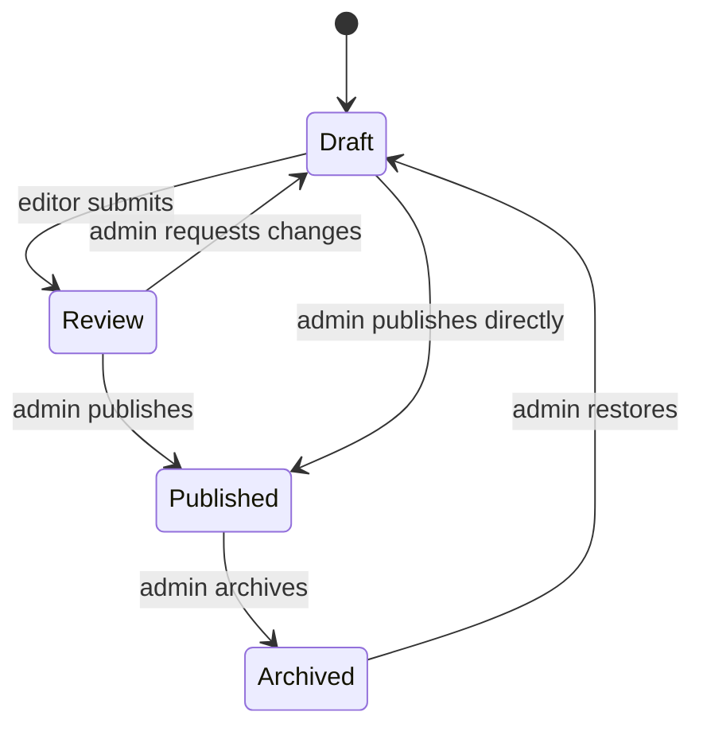

# EduMark Website System Architecture Plan

Planning date: 2026-06-10
Status: Architecture plan only, no build work
Target hosting: Vercel
Target database and backend services: Supabase

## 1. Version And Stack Decision

The requested stack is Next.js, TypeScript, React, CSS/Tailwind, Vercel, and Supabase.

Important version note:

- Next.js 19 is not a stable published Next.js release as of 2026-06-10.
- The npm `next` package currently reports `16.2.9` as latest, while the official Next.js docs are in the 16.x line.
- React is currently in the 19.x line.
- Recommended stack for this project: Next.js 16.x latest stable, React 19.x, TypeScript, Tailwind CSS 4.x, Supabase, Vercel.
- When Next.js 19 becomes stable, upgrade only after checking the Next.js release notes, Vercel support status, Supabase SSR compatibility, and security advisories.

## 2. Architecture Goals

The website should be:

- Fast for public visitors in Nepal and international audiences.
- Easy for EduMark staff to update through an admin panel.
- Secure by default, with explicit controls for OWASP Top 10:2025 and OWASP API Security Top 10:2023.
- Scalable on Vercel and Supabase without a custom server.
- Search-engine friendly for destinations, blogs, services, tests, and consultation pages.
- Auditable, with admin action logs and lead history.
- Resilient to spam, form abuse, broken access control, exposed secrets, unsafe file uploads, and accidental draft publication.

## 3. High-Level System Overview



## 4. Application Boundaries

### Public Website

Public pages defined by the existing EduMark plan:

- Home
- About
- Services
- Destinations listing
- Individual destination pages
- Test Preparation listing
- Individual test pages for IELTS, PTE, TOEFL, SAT
- Entrance Preparations
- Blogs
- Individual blog posts
- Videos Gallery
- Contact
- Book Free Consultation

### Admin Panel

Admin panel path:

- `/admin`

Admin panel must include:

- Secure login and role-based access.
- Dashboard with leads, bookings, recent content, draft warnings, and content health.
- Lead and consultation booking management.
- Content management for all public pages.
- Destination management.
- Test preparation management.
- Entrance preparation management.
- Blog and category management.
- Video gallery management.
- Team and testimonial management.
- Media library.
- SEO metadata and sitemap controls.
- Redirect management.
- User and role management.
- Site settings.
- Security center with audit logs, failed login review, and form abuse events.
- Cache revalidation controls.

### External Integrations

Initial recommended integrations:

- Supabase Auth for admin users.
- Supabase Postgres for content, leads, bookings, and audit logs.
- Supabase Storage for media.
- Vercel Analytics and Speed Insights.
- Vercel Firewall/WAF where plan allows.
- Google Maps embed on contact page.
- YouTube embeds for videos.
- Email provider for staff notifications, for example Resend, SendGrid, or Supabase-compatible SMTP.
- Optional WhatsApp deep links for lead follow-up.
- Optional bot protection such as Cloudflare Turnstile, hCaptcha, or Vercel BotID.

## 5. Recommended Technology Stack

### Frontend

- Next.js App Router, latest stable 16.x line at planning time.
- React 19.x.
- TypeScript with strict mode.
- Tailwind CSS 4.x.
- CSS variables for EduMark brand tokens.
- Component system using Radix UI primitives or shadcn/ui patterns.
- Lucide React icons.
- React Hook Form for forms.
- Zod for validation schemas.
- `next/image` for optimized images.
- `next/font` for font loading.
- `next/metadata` for SEO.

### Backend In Next.js

- Server Components for public content rendering.
- Server Actions for controlled mutations.
- Route Handlers for webhooks, downloads, exports, and API-like endpoints.
- Next.js Proxy for auth token refresh and route protection.
- `revalidatePath` and `revalidateTag` for publish-time cache refresh.
- No custom Node server.

### Database And Backend Services

- Supabase Postgres.
- Supabase Auth.
- Supabase Storage.
- Supabase Row Level Security on all exposed tables.
- Supabase database functions for safe privileged workflows.
- Supabase migrations committed to the repo.
- Supabase generated TypeScript types.

### Quality And Security Tooling

- ESLint.
- Prettier.
- TypeScript strict checks.
- Playwright for core flows.
- Vitest for utility and server logic.
- Zod schema tests.
- npm/pnpm audit in CI.
- Dependency review and automated update checks.
- OWASP ZAP baseline scan before launch.
- Lighthouse CI for performance, accessibility, SEO, and best practices.

## 6. Rendering Strategy

Use mixed rendering:

| Area | Strategy | Reason |
| --- | --- | --- |
| Home | Static/ISR | High traffic, content changes through admin |
| About | Static/ISR | Trust content changes occasionally |
| Services | Static/ISR | Mostly structured marketing content |
| Destinations listing | Static/ISR | Can be revalidated after admin changes |
| Destination detail | Static/ISR with dynamic slugs | SEO pages, many repeat visitors |
| Test prep pages | Static/ISR | Stable content |
| Entrance prep | Static/ISR | Seasonal updates |
| Blogs listing | Static/ISR | Revalidate on post publish |
| Blog detail | Static/ISR | SEO content |
| Videos gallery | Static/ISR | Revalidate on video publish |
| Contact | Static/ISR | Includes dynamic form submission only |
| Consultation booking | Dynamic form action, static shell | Avoid caching user submissions |
| Admin panel | Dynamic, no-store | User-specific, protected |
| Admin APIs | Dynamic, no-store | Authenticated mutations |

## 7. Route Architecture

Recommended Next.js route groups:

```text
src/app/
  (public)/
    page.tsx
    about/page.tsx
    services/page.tsx
    destinations/page.tsx
    destinations/[slug]/page.tsx
    test-preparation/page.tsx
    test-preparation/[slug]/page.tsx
    entrance-preparations/page.tsx
    blogs/page.tsx
    blogs/[slug]/page.tsx
    videos-gallery/page.tsx
    contact/page.tsx
    book-free-consultation/page.tsx
  (admin)/
    admin/layout.tsx
    admin/page.tsx
    admin/login/page.tsx
    admin/leads/page.tsx
    admin/bookings/page.tsx
    admin/content/pages/page.tsx
    admin/destinations/page.tsx
    admin/test-preparation/page.tsx
    admin/entrance-preparations/page.tsx
    admin/services/page.tsx
    admin/blogs/page.tsx
    admin/videos/page.tsx
    admin/media/page.tsx
    admin/team/page.tsx
    admin/testimonials/page.tsx
    admin/seo/page.tsx
    admin/redirects/page.tsx
    admin/users/page.tsx
    admin/audit-logs/page.tsx
    admin/settings/page.tsx
    admin/security/page.tsx
  api/
    forms/inquiry/route.ts
    forms/consultation/route.ts
    forms/newsletter/route.ts
    admin/export/leads/route.ts
    webhooks/email/route.ts
    revalidate/route.ts
  robots.ts
  sitemap.ts
  manifest.ts
```

## 8. Code Organization

```text
src/
  components/
    public/
    admin/
    forms/
    layout/
    seo/
    ui/
  features/
    content/
    destinations/
    tests/
    entrance/
    blogs/
    videos/
    leads/
    bookings/
    media/
    settings/
    users/
    audit/
  lib/
    supabase/
      browser.ts
      server.ts
      admin.ts
      proxy.ts
      types.ts
    auth/
      roles.ts
      guards.ts
      permissions.ts
    cache/
      tags.ts
      revalidate.ts
    security/
      headers.ts
      rate-limit.ts
      sanitize-html.ts
      captcha.ts
      csrf.ts
    validation/
      lead.ts
      booking.ts
      content.ts
      media.ts
    seo/
      metadata.ts
      json-ld.ts
    email/
      templates.ts
      send.ts
  styles/
    globals.css
supabase/
  migrations/
  seed.sql
  config.toml
```

## 9. Admin Role Model

Roles:

| Role | Purpose | Permissions |
| --- | --- | --- |
| `super_admin` | Owner or technical admin | Full access, user management, security settings |
| `admin` | Senior EduMark staff | Full content, leads, bookings, settings |
| `editor` | Content staff | Content, blogs, videos, media, SEO drafts |
| `counselor` | Student counseling staff | Leads, bookings, notes, status updates |
| `viewer` | Read-only staff | Dashboard and read-only reporting |

Rules:

- Admin access requires Supabase Auth.
- All admin users must be listed in `admin_users`.
- Admin users should use MFA.
- Role checks happen in both Next.js server code and Supabase RLS.
- Never rely only on hidden UI controls for authorization.
- Deleted/deactivated admins remain in audit logs but cannot sign in.

## 10. Admin Panel Feature Specification

### Dashboard

- Total leads this week/month.
- Pending consultation bookings.
- Leads by preferred destination.
- Recent form submissions.
- Draft content awaiting publish.
- Broken SEO metadata alerts.
- Cache revalidation status.
- Security alerts and failed admin login summary.

### Leads

- View, filter, search, and assign leads.
- Status workflow: `new`, `contacted`, `counseling_scheduled`, `in_progress`, `converted`, `lost`, `spam`.
- Notes and timeline per lead.
- Source tracking: home form, contact form, consultation form, newsletter, destination CTA.
- Preferred destination, course interest, intake, test interest.
- CSV export for authorized roles only.
- Duplicate detection by phone/email.
- PII-safe audit logging.

### Consultation Bookings

- Calendar/list view.
- Preferred date and time.
- Assigned counselor.
- Booking status: `requested`, `confirmed`, `completed`, `cancelled`, `no_show`.
- Staff notes.
- Email/WhatsApp notification trigger.
- Rescheduling history.

### Content CMS

- Home page sections.
- About page content and leadership team.
- Services.
- Destinations.
- Test preparation pages.
- Entrance preparation page.
- Blogs.
- Videos gallery.
- Testimonials.
- Team members.
- FAQs.
- Trust badges and accreditations.

Content workflow:

- Draft.
- Review.
- Published.
- Archived.
- Preview mode for drafts.
- Publish action triggers cache revalidation.

### SEO

- Page title.
- Meta description.
- Canonical URL.
- Open Graph image.
- Robots rules.
- JSON-LD structured data.
- Sitemap include/exclude.
- Redirects.
- Slug history.

### Media Library

- Upload images and documents.
- Store public media in a public Supabase Storage bucket.
- Store internal files in a private bucket.
- Validate file type, size, and extension.
- Generate alt text field manually.
- Track usage of media across content.
- Prevent deletion while media is in use unless force-confirmed by super admin.

### Security Center

- Admin users and roles.
- MFA status.
- Recent failed login attempts.
- Form spam events.
- Rate limit blocks.
- Audit log search.
- API/webhook failure log.
- Security checklist status.

## 11. Database Schema Blueprint

Use UUID primary keys, `created_at`, `updated_at`, `created_by`, `updated_by`, and soft deletion where useful.

### Core Admin Tables

#### `admin_users`

Purpose: maps Supabase Auth users to EduMark admin roles.

Columns:

- `id uuid primary key`
- `user_id uuid unique references auth.users(id)`
- `full_name text not null`
- `email text not null`
- `role admin_role not null`
- `status admin_status not null default 'active'`
- `mfa_required boolean not null default true`
- `last_seen_at timestamptz`
- `created_at timestamptz`
- `updated_at timestamptz`

#### `audit_logs`

Purpose: immutable record of admin actions and sensitive events.

Columns:

- `id uuid primary key`
- `actor_user_id uuid`
- `actor_email text`
- `action text not null`
- `entity_table text`
- `entity_id uuid`
- `before jsonb`
- `after jsonb`
- `ip_hash text`
- `user_agent_hash text`
- `created_at timestamptz not null`

#### `security_events`

Purpose: records failed auth, blocked requests, suspicious form patterns.

Columns:

- `id uuid primary key`
- `event_type text not null`
- `severity text not null`
- `fingerprint text`
- `details jsonb`
- `resolved_at timestamptz`
- `created_at timestamptz`

### Site Configuration Tables

#### `site_settings`

- `id uuid primary key`
- `key text unique not null`
- `value jsonb not null`
- `description text`
- `updated_by uuid`
- `updated_at timestamptz`

Examples:

- contact phones
- address
- social links
- office hours
- trust badges
- supported destinations
- form destination options

#### `navigation_items`

- `id uuid primary key`
- `label text not null`
- `href text not null`
- `parent_id uuid references navigation_items(id)`
- `sort_order int not null`
- `is_cta boolean default false`
- `status content_status not null`

#### `redirects`

- `id uuid primary key`
- `source_path text unique not null`
- `target_path text not null`
- `status_code int not null default 301`
- `is_active boolean not null default true`
- `created_at timestamptz`

### Content Tables

#### `pages`

Purpose: high-level public pages and SEO fields.

- `id uuid primary key`
- `slug text unique not null`
- `title text not null`
- `page_type text not null`
- `status content_status not null`
- `seo_title text`
- `seo_description text`
- `og_image_id uuid references media_assets(id)`
- `canonical_path text`
- `published_at timestamptz`
- `created_at timestamptz`
- `updated_at timestamptz`

#### `page_sections`

Purpose: structured sections for home, about, services, and reusable content.

- `id uuid primary key`
- `page_id uuid references pages(id)`
- `section_key text not null`
- `section_type text not null`
- `title text`
- `subtitle text`
- `body jsonb not null`
- `media_id uuid references media_assets(id)`
- `sort_order int not null`
- `status content_status not null`

#### `destinations`

- `id uuid primary key`
- `slug text unique not null`
- `name text not null`
- `country_code text`
- `summary text`
- `hero_title text`
- `hero_body text`
- `cost_range text`
- `intake_badges text[]`
- `featured boolean default false`
- `status content_status not null`
- `seo_title text`
- `seo_description text`
- `published_at timestamptz`

#### `destination_sections`

- `id uuid primary key`
- `destination_id uuid references destinations(id)`
- `section_type text not null`
- `title text`
- `body jsonb not null`
- `sort_order int not null`

Section types:

- `why_country`
- `education_system`
- `popular_courses`
- `universities`
- `cost`
- `visa`
- `intakes`
- `scholarships`
- `language_prep`
- `faqs`
- `cta`

#### `universities`

- `id uuid primary key`
- `destination_id uuid references destinations(id)`
- `name text not null`
- `city text`
- `ranking_notes text`
- `website_url text`
- `status content_status not null`

#### `test_preparations`

- `id uuid primary key`
- `slug text unique not null`
- `name text not null`
- `summary text`
- `test_type text`
- `format jsonb`
- `features jsonb`
- `status content_status not null`
- `seo_title text`
- `seo_description text`

#### `entrance_programs`

- `id uuid primary key`
- `slug text unique not null`
- `name text not null`
- `summary text`
- `features jsonb`
- `offer jsonb`
- `status content_status not null`

Expected rows:

- CEE
- CMAT

#### `services`

- `id uuid primary key`
- `slug text unique not null`
- `name text not null`
- `summary text`
- `body jsonb`
- `sort_order int not null`
- `status content_status not null`

#### `team_members`

- `id uuid primary key`
- `name text not null`
- `role_title text not null`
- `bio text`
- `image_id uuid references media_assets(id)`
- `sort_order int not null`
- `status content_status not null`

#### `testimonials`

- `id uuid primary key`
- `student_name text not null`
- `destination text`
- `quote text not null`
- `image_id uuid references media_assets(id)`
- `status content_status not null`
- `sort_order int`

### Blog And Video Tables

#### `blog_categories`

- `id uuid primary key`
- `slug text unique not null`
- `name text not null`
- `description text`
- `sort_order int`

#### `blog_posts`

- `id uuid primary key`
- `slug text unique not null`
- `title text not null`
- `excerpt text`
- `content jsonb not null`
- `category_id uuid references blog_categories(id)`
- `cover_image_id uuid references media_assets(id)`
- `author_admin_id uuid references admin_users(id)`
- `status content_status not null`
- `featured boolean default false`
- `published_at timestamptz`
- `seo_title text`
- `seo_description text`

#### `videos`

- `id uuid primary key`
- `title text not null`
- `description text`
- `provider text not null`
- `provider_video_id text not null`
- `category text not null`
- `thumbnail_id uuid references media_assets(id)`
- `duration_seconds int`
- `status content_status not null`
- `sort_order int`

### Lead And Booking Tables

#### `leads`

- `id uuid primary key`
- `full_name text not null`
- `phone text not null`
- `email text`
- `preferred_destination text`
- `course_interest text`
- `message text`
- `source text not null`
- `status lead_status not null default 'new'`
- `assigned_to uuid references admin_users(id)`
- `spam_score numeric default 0`
- `ip_hash text`
- `user_agent_hash text`
- `created_at timestamptz`
- `updated_at timestamptz`

#### `lead_notes`

- `id uuid primary key`
- `lead_id uuid references leads(id)`
- `author_admin_id uuid references admin_users(id)`
- `note text not null`
- `created_at timestamptz`

#### `lead_events`

- `id uuid primary key`
- `lead_id uuid references leads(id)`
- `event_type text not null`
- `metadata jsonb`
- `created_at timestamptz`

#### `consultation_bookings`

- `id uuid primary key`
- `full_name text not null`
- `phone text not null`
- `email text`
- `preferred_destination text`
- `course_interest text`
- `preferred_date date`
- `preferred_time text`
- `message text`
- `status booking_status not null default 'requested'`
- `assigned_to uuid references admin_users(id)`
- `lead_id uuid references leads(id)`
- `ip_hash text`
- `user_agent_hash text`
- `created_at timestamptz`
- `updated_at timestamptz`

#### `newsletter_subscribers`

- `id uuid primary key`
- `email text unique not null`
- `status text not null default 'active'`
- `source text`
- `created_at timestamptz`

### Media Tables

#### `media_assets`

- `id uuid primary key`
- `bucket text not null`
- `path text unique not null`
- `file_name text not null`
- `mime_type text not null`
- `size_bytes bigint not null`
- `width int`
- `height int`
- `alt_text text`
- `caption text`
- `uploaded_by uuid references admin_users(id)`
- `created_at timestamptz`

## 12. Database Enums

Recommended enum values:

```text
admin_role:
  super_admin
  admin
  editor
  counselor
  viewer

admin_status:
  active
  suspended
  deleted

content_status:
  draft
  review
  published
  archived

lead_status:
  new
  contacted
  counseling_scheduled
  in_progress
  converted
  lost
  spam

booking_status:
  requested
  confirmed
  completed
  cancelled
  no_show
```

## 13. Indexing Plan

Create indexes for:

- All `slug` fields.
- All foreign keys.
- `status`.
- `published_at desc`.
- `created_at desc`.
- `leads(status, created_at desc)`.
- `leads(assigned_to, status)`.
- `consultation_bookings(status, preferred_date)`.
- `blog_posts(category_id, status, published_at desc)`.
- Full-text search indexes for blog posts, destinations, services, and test prep pages.

Use cursor pagination for admin tables and blog listings.

## 14. Supabase Security Model

### Key Rules

- Enable RLS on every table in the public schema.
- Do not expose Supabase secret/service keys in browser code.
- Browser only receives publishable key.
- Server-only privileged operations use server environment variables.
- Public content can be read only when `status = 'published'`.
- Leads and bookings are never publicly readable.
- Public forms submit through Next.js server actions or route handlers.
- Admin data access requires a signed-in user and a valid active role in `admin_users`.
- Admin mutations are checked in both app code and RLS.

### RLS Policy Pattern

Public published content:

```sql
-- blueprint only
allow anon select when status = 'published'
allow authenticated select when status = 'published'
allow admin roles select/insert/update/delete
```

Private lead data:

```sql
-- blueprint only
deny anon select/update/delete
deny browser-side anon insert unless explicitly using a safe insert-only policy
allow counselor/admin select based on role
allow assigned counselor update limited status and notes
allow admin/super_admin full management
```

Admin users:

```sql
-- blueprint only
allow user to read own admin profile
allow super_admin to manage admin users
deny normal admin role escalation
```

### Recommended Helper Functions

Use helper functions to keep RLS policies consistent:

- `public.current_admin_role()`
- `public.is_admin()`
- `public.has_admin_role(required_roles text[])`
- `public.can_manage_content()`
- `public.can_manage_leads()`
- `public.can_manage_users()`

Security rules for helper functions:

- Prefer `security invoker` unless privilege escalation is required.
- If `security definer` is required, always set `search_path`.
- Revoke function execution from `public` by default.
- Grant execution only to required roles.
- Avoid relying on mutable `raw_user_meta_data` for permissions.

## 15. Database Function Blueprint

### Public Form Functions

#### `submit_lead`

Purpose:

- Validate normalized lead data.
- Insert into `leads`.
- Detect duplicates.
- Add `lead_events`.
- Return only a safe success response.

Inputs:

- full name
- phone
- email
- destination
- course interest
- message
- source
- request fingerprint

Security:

- Called only from server-side Next.js code.
- Rate limited before execution.
- Does not return lead details to public visitors.

#### `submit_consultation_booking`

Purpose:

- Insert consultation booking.
- Create or link a lead.
- Notify admin staff.
- Return booking receipt ID.

Security:

- Called only from server-side Next.js code.
- Validate date/time format.
- Apply anti-spam checks.

### Admin Content Functions

#### `publish_content`

Purpose:

- Move entity from draft/review to published.
- Set `published_at`.
- Insert audit log.
- Return cache tags to revalidate.

#### `archive_content`

Purpose:

- Archive content without deleting it.
- Insert audit log.
- Trigger cache revalidation.

#### `reserve_slug`

Purpose:

- Prevent duplicate slugs.
- Normalize slug values.
- Store slug history if URLs change.

### Lead Functions

#### `assign_lead`

Purpose:

- Assign a lead to counselor/admin.
- Record lead event.
- Insert audit log.

#### `update_lead_status`

Purpose:

- Move lead through workflow.
- Require notes for `lost` or `spam`.
- Insert lead event.

#### `export_leads`

Purpose:

- Controlled export for admin/super_admin only.
- Record export event.
- Mask sensitive values if requested.

### Audit Functions

#### `audit_row_change`

Purpose:

- Generic trigger function for sensitive tables.
- Records before/after JSON.
- Avoids storing raw secrets.

Tables requiring audit:

- `admin_users`
- `leads`
- `consultation_bookings`
- `site_settings`
- `pages`
- `blog_posts`
- `destinations`
- `redirects`

## 16. Public Form Architecture

All public forms use this flow:



Controls:

- Zod validation on server.
- HTML form constraints on client for usability only.
- Honeypot field.
- Minimum submit time check.
- Rate limit by IP hash, phone, and email.
- CAPTCHA for suspicious traffic.
- Body size limit.
- Generic error messages.
- No direct database access from public browser forms.

## 17. Authentication And Authorization

### Admin Auth

- Supabase Auth email/password or magic link.
- MFA required for admin roles.
- Session stored in secure HTTP-only cookies through Supabase SSR helpers.
- Next.js Proxy refreshes auth tokens.
- Admin layout checks `supabase.auth.getClaims()`.
- Server actions re-check authorization before every mutation.

### Authorization Layers

1. UI permission: hide unavailable actions.
2. Server guard: enforce role on page loaders, actions, and route handlers.
3. RLS policy: enforce final database access.
4. Audit log: record sensitive changes.

## 18. API And Server Action Inventory

### Public Server Actions

- `submitInquiry`
- `submitConsultationBooking`
- `subscribeNewsletter`

### Admin Server Actions

- `createPage`
- `updatePage`
- `publishPage`
- `archivePage`
- `createDestination`
- `updateDestination`
- `publishDestination`
- `createBlogPost`
- `updateBlogPost`
- `publishBlogPost`
- `updateLeadStatus`
- `assignLead`
- `addLeadNote`
- `confirmBooking`
- `uploadMediaMetadata`
- `updateSeoMetadata`
- `createRedirect`
- `updateSiteSettings`
- `inviteAdminUser`
- `changeAdminRole`
- `deactivateAdminUser`
- `revalidateContent`

### Route Handlers

- `/api/forms/inquiry`
- `/api/forms/consultation`
- `/api/forms/newsletter`
- `/api/admin/export/leads`
- `/api/revalidate`
- `/api/webhooks/email`
- `/api/og`

Route handler rules:

- Reject unsupported HTTP methods.
- Validate `Origin` and `Host`.
- Enforce JSON body limits.
- Return structured errors without stack traces.
- Mark user-specific/admin responses `no-store`.
- Add audit logs for sensitive actions.

## 19. Caching Architecture

### Cache Layers

1. Browser cache for static assets.
2. Vercel CDN for public pages and assets.
3. Next.js Data Cache for server fetches.
4. Next.js Full Route Cache for static/ISR routes.
5. Supabase/Postgres indexes and query planning.
6. Optional materialized views for heavy listings.

### Cache Tags

Recommended tags:

- `home`
- `site-settings`
- `navigation`
- `pages`
- `page:{slug}`
- `destinations`
- `destination:{slug}`
- `services`
- `tests`
- `test:{slug}`
- `entrance`
- `blogs`
- `blog:{slug}`
- `videos`
- `team`
- `testimonials`

### Revalidation Rules

| Admin action | Revalidate |
| --- | --- |
| Publish home section | `home`, `site-settings` if relevant |
| Update navigation | `navigation`, all public layout routes |
| Publish destination | `destinations`, `destination:{slug}`, `sitemap` |
| Publish blog | `blogs`, `blog:{slug}`, `sitemap` |
| Update team | `team`, `about`, `home` if previewed there |
| Update testimonial | `testimonials`, `home` |
| Update site settings | `site-settings`, all public layout routes |
| Create redirect | redirect cache and affected route |

### No-Cache Areas

Always dynamic and `no-store`:

- Admin panel pages.
- Auth callbacks.
- Form POST handlers.
- Export endpoints.
- Webhooks.
- Any response that sets cookies.

### Caching Risk Control

Never cache responses that include `Set-Cookie`, admin data, user-specific session data, lead data, booking data, or draft content.

## 20. Security Headers

Set security headers through `next.config.ts` or proxy/route middleware.

Recommended baseline:

```text
Strict-Transport-Security: max-age=63072000; includeSubDomains; preload
X-Content-Type-Options: nosniff
X-Frame-Options: DENY
Referrer-Policy: strict-origin-when-cross-origin
Permissions-Policy: camera=(), microphone=(), geolocation=(self)
Cross-Origin-Opener-Policy: same-origin
Cross-Origin-Resource-Policy: same-site
Content-Security-Policy: strict project-specific policy
```

CSP allowlist should include only required domains:

- self
- Vercel analytics if used
- Supabase project URL
- Supabase storage domain
- YouTube embed domain
- Google Maps embed domain
- Google Fonts only if fonts are not self-hosted through `next/font`

Prefer:

- Nonce-based scripts.
- No inline scripts unless nonce-protected.
- No `unsafe-eval` in production.
- Iframe sandboxing for embeds.

## 21. OWASP Top 10:2025 Control Mapping

| OWASP risk | EduMark control |
| --- | --- |
| A01 Broken Access Control | Supabase RLS, server-side role checks, object-level checks, admin route guards, audit logs |
| A02 Security Misconfiguration | Secure headers, environment separation, WAF, no public debug routes, least-privilege keys |
| A03 Software Supply Chain Failures | Lockfile, dependency scanning, pinned packages, CI audit, review of third-party packages |
| A04 Cryptographic Failures | HTTPS only, HSTS, encrypted secrets, no PII in logs, secure cookies |
| A05 Injection | Zod validation, parameterized queries, Supabase query builder, sanitized rich text, no unsafe SQL string concatenation |
| A06 Insecure Design | Threat modeling for lead forms, admin publishing, media uploads, role escalation, and cache leaks |
| A07 Authentication Failures | Supabase Auth, MFA for admins, session validation with `getClaims`, account deactivation, rate limits |
| A08 Software/Data Integrity Failures | Protected branches, reviewed migrations, signed webhooks, audit logs, backup restore tests |
| A09 Security Logging and Alerting Failures | Audit logs, security events, Vercel/Supabase alerts, failed login monitoring |
| A10 Mishandling of Exceptional Conditions | Error boundaries, generic public errors, safe retries, transaction rollback, no stack traces in production |

## 22. OWASP API Security Top 10:2023 Control Mapping

| API risk | EduMark control |
| --- | --- |
| API1 Broken Object Level Authorization | RLS ownership and role checks on every object access |
| API2 Broken Authentication | Supabase JWT validation, secure cookies, MFA for admins |
| API3 Broken Object Property Level Authorization | Whitelisted update fields and field-level validation |
| API4 Unrestricted Resource Consumption | Rate limits, body size limits, pagination, upload size caps |
| API5 Broken Function Level Authorization | Server-side role checks per action and RLS fallback |
| API6 Sensitive Business Flow Abuse | Anti-spam controls on leads, bookings, newsletter, and exports |
| API7 SSRF | Do not fetch arbitrary user-provided URLs; validate media/embed providers |
| API8 Security Misconfiguration | Disable debug endpoints, secure CORS, strict headers |
| API9 Improper Inventory Management | Maintain route inventory, admin action inventory, and API docs |
| API10 Unsafe Consumption of APIs | Verify webhooks, timeouts, schema validation for third-party responses |

## 23. Input Validation And Content Safety

### Validation

- All public and admin inputs validated with Zod on the server.
- Phone numbers normalized.
- Email lowercased and validated.
- Slugs normalized and checked for uniqueness.
- Rich content stored as structured JSON, not raw unchecked HTML.
- If HTML is required, sanitize with an allowlist.

### File Uploads

- Admin-only upload.
- Allowed image types: `image/jpeg`, `image/png`, `image/webp`, `image/avif`.
- Optional document types: `application/pdf` for internal files only.
- Max image size: define based on Vercel and Supabase limits, recommended 5 MB initial cap.
- Verify MIME type and extension.
- Store internal documents in private bucket only.
- Never execute uploaded content.
- Serve user-uploaded SVG only if sanitized or disallow SVG uploads.

## 24. Data Privacy And Retention

Lead and consultation data contains personal information.

Required practices:

- Store only needed information.
- Hash IP and user agent for abuse detection.
- Do not log raw phone/email in application logs.
- Restrict exports to admin/super_admin.
- Audit every export.
- Define retention policy, for example archive or anonymize stale leads after 24 months.
- Allow manual deletion/anonymization on request.
- Do not send sensitive data to analytics tools.

## 25. Observability

### Vercel

- Runtime logs.
- Web Analytics.
- Speed Insights and Core Web Vitals.
- Error tracking integration, for example Sentry.
- Deployment checks.

### Supabase

- Postgres logs.
- Auth logs.
- Storage logs.
- Query performance review.
- Database backups and restore tests.

### Application-Level Events

Track:

- Lead submissions.
- Booking submissions.
- Admin logins.
- Failed admin access.
- Content publish/archive.
- User role changes.
- Lead exports.
- Cache revalidation.
- Rate limit blocks.

## 26. Deployment Architecture

### Environments

Use three environments:

| Environment | Purpose |
| --- | --- |
| Local | Developer testing with local env |
| Preview | Vercel preview deployments for branches |
| Production | Public live website |

### Environment Variables

Client-safe:

- `NEXT_PUBLIC_SUPABASE_URL`
- `NEXT_PUBLIC_SUPABASE_PUBLISHABLE_KEY`
- `NEXT_PUBLIC_SITE_URL`

Server-only:

- `SUPABASE_SECRET_KEY`
- `SUPABASE_SERVICE_ROLE_KEY` if required for restricted server tasks
- `REVALIDATION_SECRET`
- `EMAIL_API_KEY`
- `CAPTCHA_SECRET_KEY`
- `WEBHOOK_SECRET`
- `SENTRY_DSN` if used server-side

Rules:

- Never commit `.env.local`.
- Use Vercel encrypted environment variables.
- Use different Supabase projects or schemas for preview and production.
- Rotate secrets after developer offboarding.

## 27. CI/CD Pipeline

Recommended pipeline:

1. Install dependencies with lockfile enforcement.
2. Type check.
3. Lint.
4. Unit tests.
5. Build.
6. Supabase migration dry-run or validation.
7. Playwright smoke tests on preview.
8. Lighthouse CI on important public pages.
9. OWASP ZAP baseline scan on preview.
10. Manual production promotion after approval.

Branch protection:

- Require passing checks before merge.
- Require review for migrations and security-sensitive files.
- Block direct production deploy from unreviewed branches.

## 28. Backup And Disaster Recovery

Required:

- Supabase automated backups.
- Manual backup before major migrations.
- Monthly restore test into staging.
- Export admin audit logs to durable storage if compliance requires.
- Keep migration files in Git.
- Keep media assets in Supabase Storage with retention policy.

Recovery targets:

- RPO: 24 hours for content and leads at minimum, improve based on Supabase plan.
- RTO: 4 hours for site availability after critical incident.

## 29. Performance Plan

Targets:

- Lighthouse performance 90+ on main public pages.
- Core Web Vitals pass on mobile.
- LCP under 2.5 seconds for common pages.
- CLS under 0.1.
- INP under 200 ms.

Controls:

- Use server components by default.
- Minimize client components.
- Optimize images through `next/image`.
- Use responsive image sizes.
- Lazy-load maps and video embeds.
- Use skeletons for admin tables.
- Paginate admin lists.
- Use database indexes.
- Avoid large JSON payloads in public pages.
- Use dynamic imports for admin-only heavy components.

## 30. SEO Architecture

Each public page needs:

- Unique title.
- Meta description.
- Canonical URL.
- Open Graph title, description, and image.
- Twitter card metadata.
- JSON-LD where appropriate.
- Sitemap inclusion.
- Robots rules.

Recommended JSON-LD:

- `Organization` for EduMark.
- `LocalBusiness` or `EducationalOrganization`.
- `BreadcrumbList` for nested pages.
- `Article` for blogs.
- `FAQPage` for destination/test FAQs where displayed.

Sitemap:

- Generated from published pages only.
- Includes destinations, tests, blogs, and key pages.
- Excludes admin, drafts, archived content, and form endpoints.

## 31. Accessibility Plan

Requirements:

- WCAG 2.2 AA target.
- Semantic headings.
- Keyboard navigable menus and admin controls.
- Visible focus states.
- Accessible form labels and errors.
- Color contrast checked against brand palette.
- Alt text required for important media.
- Captions or transcripts for important videos where possible.

## 32. Admin Publishing Flow



On publish:

1. Validate required fields.
2. Validate SEO fields.
3. Validate slug uniqueness.
4. Update database transactionally.
5. Write audit log.
6. Revalidate cache tags.
7. Regenerate sitemap data.
8. Show admin confirmation.

## 33. Migration Plan From Current Planning Files

The existing files are:

- `edumark-website-plan.md`
- `edumark-website-plan.html`

Use them as content source, not runtime implementation.

Migration steps:

1. Convert sitemap into route list.
2. Convert page sections into `pages` and `page_sections`.
3. Convert destinations into `destinations` and `destination_sections`.
4. Convert tests into `test_preparations`.
5. Convert leadership into `team_members`.
6. Convert trust badges and contact details into `site_settings`.
7. Load current images into `media_assets`.
8. Create initial admin user.
9. Validate all public pages before launch.

## 34. Implementation Phases

### Phase 1: Foundation

- Scaffold Next.js project.
- Add TypeScript strict mode.
- Add Tailwind and base design tokens.
- Connect Supabase.
- Add environment setup.
- Add security headers.
- Add CI pipeline.

### Phase 2: Database And Security

- Create Supabase schema.
- Create enums.
- Add RLS policies.
- Add admin role helpers.
- Add audit logs.
- Add storage buckets and policies.
- Generate TypeScript database types.

### Phase 3: Public Website

- Build public layout.
- Build pages from existing content plan.
- Add forms.
- Add SEO metadata and sitemap.
- Add image optimization.
- Add caching and revalidation tags.

### Phase 4: Admin Panel

- Admin auth and route protection.
- Dashboard.
- Content CMS.
- Lead and booking management.
- Media library.
- User and role management.
- Audit log viewer.
- Cache revalidation UI.

### Phase 5: Security And Launch

- OWASP checklist.
- ZAP baseline scan.
- Playwright tests.
- Lighthouse checks.
- Accessibility QA.
- Backup restore test.
- Production deployment.
- Post-launch monitoring.

## 35. Launch Checklist

### Stack

- Next.js stable version pinned.
- React 19 compatible version pinned.
- TypeScript strict mode enabled.
- Tailwind configured.
- Lockfile committed.

### Supabase

- RLS enabled on all exposed tables.
- Admin helper functions reviewed.
- Storage policies applied.
- Backups enabled.
- Types generated.
- Production secrets configured.

### Security

- MFA enabled for admins.
- Security headers active.
- CSP tested.
- WAF/rate limiting configured.
- Form anti-spam enabled.
- No service key in client bundle.
- Admin routes no-store.
- Public form responses generic.
- Audit logging active.

### Content

- All pages populated.
- All destination pages published.
- Test prep pages published.
- Contact details verified.
- Leadership details verified.
- SEO metadata complete.
- Redirects configured.
- Sitemap generated.

### QA

- Mobile and desktop tested.
- Forms tested.
- Admin workflows tested.
- Cache revalidation tested.
- Lighthouse passed.
- Accessibility pass.
- Security scan reviewed.

## 36. Open Decisions

Before build starts, decide:

- Final admin roles and exact staff list.
- Whether to use Supabase Auth email/password, magic link, or both.
- Email provider for notifications.
- Bot protection provider.
- Whether consultation bookings need calendar integration.
- Whether blogs use rich text JSON, MDX, or a structured block editor.
- Whether videos are YouTube-only or support uploaded videos.
- Whether forms need Nepali and English versions.
- Final data retention period for leads.
- Whether to use a separate staging Supabase project.

## 37. Source References Checked

Checked on 2026-06-10:

- Next package latest: https://registry.npmjs.org/next/latest
- React package latest: https://registry.npmjs.org/react/latest
- Next.js headers docs: https://nextjs.org/docs/app/api-reference/config/next-config-js/headers
- Next.js caching docs: https://nextjs.org/docs/app/getting-started/caching
- Next.js CSP docs: https://nextjs.org/docs/app/guides/content-security-policy
- Vercel Next.js docs: https://vercel.com/docs/frameworks/full-stack/nextjs
- Vercel security docs: https://vercel.com/docs/security
- Supabase SSR client docs: https://supabase.com/docs/guides/auth/server-side/nextjs
- Supabase RLS docs: https://supabase.com/docs/guides/database/postgres/row-level-security
- Supabase database functions docs: https://supabase.com/docs/guides/database/functions
- OWASP Top 10:2025: https://owasp.org/Top10/2025/
- OWASP API Security Top 10:2023: https://owasp.org/API-Security/editions/2023/en/0x11-t10/
